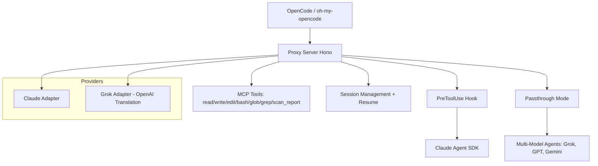
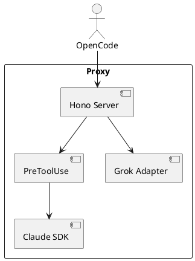

# OmniProxy + OmniRoute Explainer

**Permanent Global Multi-Provider LLM Proxy/Router for OpenCode + Enterprise**

Combines our Anthropic/Grok proxy with OmniRoute concepts for any-model, any-provider, cost-optimized routing (local/cloud, fuzzy logic, mlua rules, NSP V2 memory fabric).

## Overview

This proxy bridges OpenCode to Claude Max (and Grok) with full agent SDK support, passthrough for multi-model delegation, session management, and MCP tools.

- **Core**: Hono server + Claude Agent SDK (PreToolUse hook)
- **Modes**: Internal MCP or passthrough to preserve OpenCode routing
- **Providers**: Claude, Grok (xAI), extensible via ProviderAdapter
- **Dashboard**: scanner-dashboard.html for reports
- **Maintenance**: Daily upstream review + auto-patches

## Architecture (Mermaid)



## Getting Started

1. Clone: `git clone <repo>`
2. Install: `bun install`
3. Env: `ANTHROPIC_API_KEY=... XAI_API_KEY=...`
4. Run: `CLAUDE_PROXY_PASSTHROUGH=1 bun run proxy`
5. Use with OpenCode: set baseURL to proxy

## Config (opencode.json)

```json
{
  "$schema": "https://opencode.ai/config.json",
  "model": "anthropic/claude-sonnet-4",
  "agent": {
    "general": { "model": "xai/grok-4" }
  }
}
```

## Key Components

| Component | Purpose | File |
|-----------|---------|------|
| server.ts | Core proxy logic | src/proxy/server.ts |
| mcpTools.ts | MCP tools incl. scan_report | src/mcpTools.ts |
| agentMatch.ts | Fuzzy agent matching | src/proxy/agentMatch.ts |
| ProviderAdapter | Extensible providers | src/providers/ |

## PlantUML Architecture



## SVG Logo Placeholder

```svg
<svg width="200" height="100" xmlns="http://www.w3.org/2000/svg">
  <rect width="200" height="100" fill="#0e0e12"/>
  <text x="20" y="60" font-size="24" fill="#60a5fa">OmniProxy</text>
</svg>
```

## Next Steps
- Run daily maintenance script
- Add new providers via adapter
- Monitor dashboard for reports

See AGENTS.md, ROADMAP.md, and reference/opencode-upstream for details.
